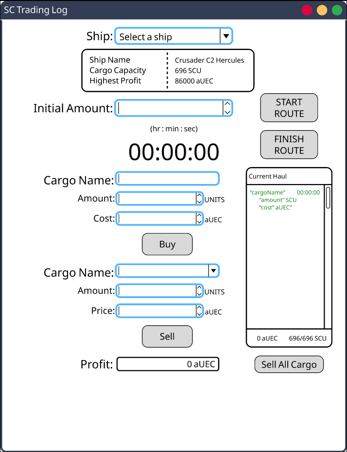

# Star Citizen Cargo Log GUI
## About
The goal of this program is to practice creating GUI applications for practical purposes. This 
application will allow users to track cargo runs in the game star citizen. It will ask for the 
user to select the ship they are using ingame to haul cargo and their initial in-game balance. 
The program will adjust displayed values according to the stats of the selected ship. It will 
track every cargo order purchased and sold that is input by the use and display it in a log 
window that is updated accordingly. The app will also help the player manage cargo space and 
provide overall statistics like profit / minute, profit / cargoType, etc.

## Concept Design

600x750 px

Link to project done in Figma

[https://www.figma.com/file/pglVAOtRSng9ekZc20Qi3f/SC-Trading-Log-GUI-Design-ver-1?type=design&node-id=0%3A1&mode=design&t=2e0dG0I28tio3z8e-1](https://www.figma.com/file/pglVAOtRSng9ekZc20Qi3f/SC-Trading-Log-GUI-Design-ver-1?type=design&node-id=0%3A1&mode=design&t=2e0dG0I28tio3z8e-1)

## Library
### wxWidgets
Download: [https://www.wxwidgets.org/downloads/](https://www.wxwidgets.org/downloads/)

Install Tutorial Video: [https://www.youtube.com/watch?v=ONYW3hBbk-8&list=PLFk1_lkqT8MbVOcwEppCPfjGOGhLvcf9G&index=2](https://www.youtube.com/watch?v=ONYW3hBbk-8&list=PLFk1_lkqT8MbVOcwEppCPfjGOGhLvcf9G&index=2)

By OttoBotCode

## Credit:
Designer: Cameron Abo

Programmers: Cameron Abo, Garron Grim
